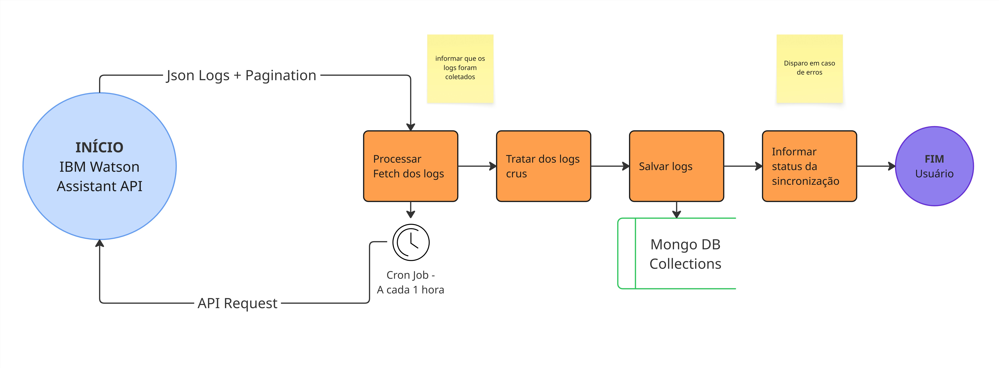

# 🤖 Watson Assistant Log Persistence Service

Este serviço é responsável por coletar, processar e persistir logs do Watson Assistant em um banco de dados MongoDB. Ele opera como um serviço de cron job, executando periodicamente para manter os dados atualizados.

## 🗂️ Estrutura do Projeto

```
src/
├── config/         # Configurações do projeto e conexão com o banco (database.ts)
├── controllers/    # Controladores da aplicação
├── docs/           # Documentação e imagens
├── models/         # Modelos do MongoDB (gerados a partir dos schemas Zod)
├── repositories/   # Camada de acesso a dados
├── schemas/        # Schemas de validação (Zod)
├── services/       # Serviços da aplicação
└── utils/          # Utilitários genéricos
```

## 🧩 Schemas e Tipos

### Assistant Schema

Schema para validação dos dados do Watson Assistant.

```typescript
// AssistantSkill
{
  type: string;      // Tipo da habilidade
  skill_id: string;  // ID único da habilidade
}

// AssistantEnvironment
{
  name: string;           // Nome do ambiente (ex: 'live', 'development')
  environment: string;    // Tipo do ambiente
  environment_id: string; // ID único do ambiente
}

// Assistant
{
  name: string;                    // Nome do assistente
  language: string;                // Idioma do assistente
  description: string;             // Descrição do assistente
  assistant_id: string;            // ID único do assistente
  assistant_skills: AssistantSkill[];      // Lista de habilidades
  assistant_environments: AssistantEnvironment[]; // Lista de ambientes
}

// AssistantResponse
{
  assistants: Assistant[];         // Lista de assistentes
  pagination: {                    // Informações de paginação
    refresh_url: string;          // URL para atualizar os resultados
  }
}
```

### Logs Schema

Schemas para validação dos logs do Watson Assistant.

```typescript
// Log (Log bruto da IBM)
{
  log_id: string;                 // ID único do log na IBM
  request_timestamp: string;       // Timestamp da requisição
  response_timestamp: string;      // Timestamp da resposta
  language: string;               // Idioma da conversa
  customer_id?: string;           // ID do cliente (opcional)
  assistant_id: string;           // ID do assistente virtual
  session_id: string;             // ID da sessão da conversa
  input: any;                     // Dados de entrada da conversa
  response: any;                  // Dados de resposta da conversa
}

// LogCollection
{
  logs: Log[];                    // Lista de logs
  pagination: {                   // Informações de paginação
    next_url: string | null;      // URL para próxima página
  }
}

// LogsResponse
{
  startDate: string;              // Data de início do período em ISO 8601
  endDate: string;                // Data de fim do período em ISO 8601
  assistants: {                   // Mapa de logs por assistente
    [assistantName: string]: LogCollection;
  }
}
```

### Standardized Log Schema

Schema para validação dos logs padronizados antes de salvar no MongoDB.

```typescript
// User
{
  session_id: string;             // ID da sessão do usuário
  chapa?: string;                 // Número da chapa do funcionário (opcional)
  emplid?: string;                // ID do funcionário no sistema (opcional)
}

// StandardizedLog
{
  log_id: string;                 // ID único do log
  conversation_id: string;        // ID da conversa
  user: User;                     // Dados do usuário
  context: Record<string, any>;   // Contexto da conversa (campos dinâmicos)
  input: string;                  // Texto de entrada do usuário
  intents: any[];                 // Intenções detectadas
  entities: any[];                // Entidades detectadas
  output?: any[] | null;          // Respostas do assistente
  timestamp: Date;                // Data e hora do log
}
```

### Sync Report Schema

Schema para validação do relatório de sincronização.

```typescript
// SyncStatus
{
  status: "SUCCESS" | "PARTIAL" | "FAILURE";
  missingLogs: {
    assistant: string;
    logId: string;
    timestamp: string;
  }[];
  includedLogs: {
    assistant: string;
    logId: string;
    timestamp: string;
  }[];
}

// AssistantSummary
{
  name: string;                   // Nome do assistente
  totalLogs: number;              // Total de logs processados
  includedLogs: number;           // Logs incluídos com sucesso
  missingLogs: number;            // Logs faltantes
}

// SyncReport
{
  timestamp: string;              // Data/hora do relatório
  syncStatus: SyncStatus;         // Status da sincronização
  summary: {
    totalLogs: number;            // Total de logs processados
    includedLogs: number;         // Logs incluídos com sucesso
    missingLogs: number;          // Logs faltantes
    assistants: AssistantSummary[]; // Resumo por assistente
  };
  sanitizedLogs: Record<string, LogCollection>; // Logs sanitizados
}
```

### Logger Schema

Schema para validação do logger.

```typescript
// RateLimitHeaders
{
  "x-ratelimit-remaining"?: string;
  "x-ratelimit-limit"?: string;
  "x-ratelimit-reset"?: string;
}

// Logger
{
  info(message: string, data?: unknown): void;
  warn(message: string, data?: unknown): void;
  error(message: string, data?: unknown): void;
  debug(message: string, data?: unknown): void;
  logRateLimit(headers: RateLimitHeaders, context?: string): void;
}
```

## 🔄 Fluxo de Dados


_Fluxo de dados do serviço de persistência de logs do Watson Assistant_

1. **Coleta de Logs**

   - O sistema busca logs do Watson Assistant usando o `AssistantService`
   - Os logs são validados usando o `LogsResponseSchema`

2. **Processamento**

   - Os logs brutos são transformados em um formato padronizado
   - A transformação é validada usando o `StandardizedLogSchema`

3. **Persistência**

   - Os logs padronizados são salvos no MongoDB
   - O resultado do salvamento é validado usando o `SaveResultSchema`

4. **Sincronização**
   - O sistema mantém um registro do último log sincronizado
   - O status da sincronização é registrado usando o `SyncReportSchema`
   - Relatórios detalhados são gerados para cada operação de sincronização

## ✅ Validações

Todos os schemas utilizam o Zod para validação, garantindo:

- Tipos corretos para cada campo
- Campos obrigatórios preenchidos
- Formato correto de datas (ISO 8601)
- URLs válidas
- Strings não vazias
- Números não negativos

## 💡 Exemplos de Uso

### Buscando Logs de um Assistente

```typescript
const assistantService = AssistantService.getInstance();
const logs = await assistantService.getAssistantLogs(
  "assistant-id",
  new Date("2024-01-01"),
  new Date("2024-01-31")
);
```

### Salvando Logs Padronizados

```typescript
const persistanceService = PersistanceService.getInstance();
const result = await persistanceService.saveProcessedLogs(standardizedLogs);

if (result.success) {
  console.log(`Salvos ${result.count} logs com sucesso`);
  if (result.duplicates > 0) {
    console.log(`${result.duplicates} logs duplicados ignorados`);
  }
}
```

### Atualizando Ponto de Sincronização

```typescript
const syncReport = {
  timestamp: new Date().toISOString(),
  syncStatus: {
    status: "SUCCESS",
    missingLogs: [],
    includedLogs: [],
  },
  summary: {
    totalLogs: 100,
    includedLogs: 100,
    missingLogs: 0,
    assistants: [],
  },
  sanitizedLogs: {},
};

// Validação com Zod
const validatedSyncReport = SyncReportSchema.parse(syncReport);
```

## ⚙️ Configuração

O serviço utiliza variáveis de ambiente para configuração. Crie um arquivo `.env` na raiz do projeto com as seguintes variáveis:

```env
MONGODB_URI=sua_uri_do_mongodb
WATSON_API_KEY=sua_chave_api_do_watson
WATSON_URL=sua_url_do_watson
```

## 📦 Instalação

```bash
npm install
```

## ▶️ Execução

```bash
npm start
```

## 🛠️ Desenvolvimento

```bash
npm run dev
```

## 🧪 Testes

O projeto utiliza Jest como framework de testes. Os testes estão organizados na pasta `src/__tests__/` e seguem a mesma estrutura do código fonte.

### Executando os Testes

```bash
# Executar todos os testes
npm test

# Executar testes em modo watch
npm run test:watch

# Executar testes com cobertura
npm run test:coverage
```

### Estrutura dos Testes

```
src/__tests__/
├── services/           # Testes dos serviços
│   ├── assistant.service.test.ts
│   ├── log.service.test.ts
│   └── persistance.service.test.ts
└── utils/             # Testes dos utilitários
    └── logger.test.ts
```

Os testes cobrem:

- Funcionalidades dos serviços
- Manipulação de erros
- Casos de sucesso e falha
- Validações de dados
- Comportamento do logger

## 📝 Logging

O sistema implementa um logger personalizado com as seguintes características:

### Níveis de Log

- `INFO`: Informações gerais sobre o fluxo da aplicação
- `WARN`: Avisos sobre situações que merecem atenção
- `ERROR`: Erros que precisam de intervenção
- `DEBUG`: Informações detalhadas para debugging (só ativo em modo debug)

### Funcionalidades

- Formatação de data/hora no timezone do Brasil
- Suporte a diferentes níveis de log
- Monitoramento de rate limits da API
- Modo debug configurável
- Padrão Singleton para instância única

### Exemplo de Uso

```typescript
const logger = LoggerImpl.getInstance();

// Logs básicos
logger.info("Processando assistente", { assistantId: "123" });
logger.warn("Rate limit próximo do limite", { remaining: 10 });
logger.error("Falha ao processar logs", error);

// Log de rate limit
logger.logRateLimit({
  "x-ratelimit-remaining": "100",
  "x-ratelimit-limit": "1000",
  "x-ratelimit-reset": "1234567890",
});
```
